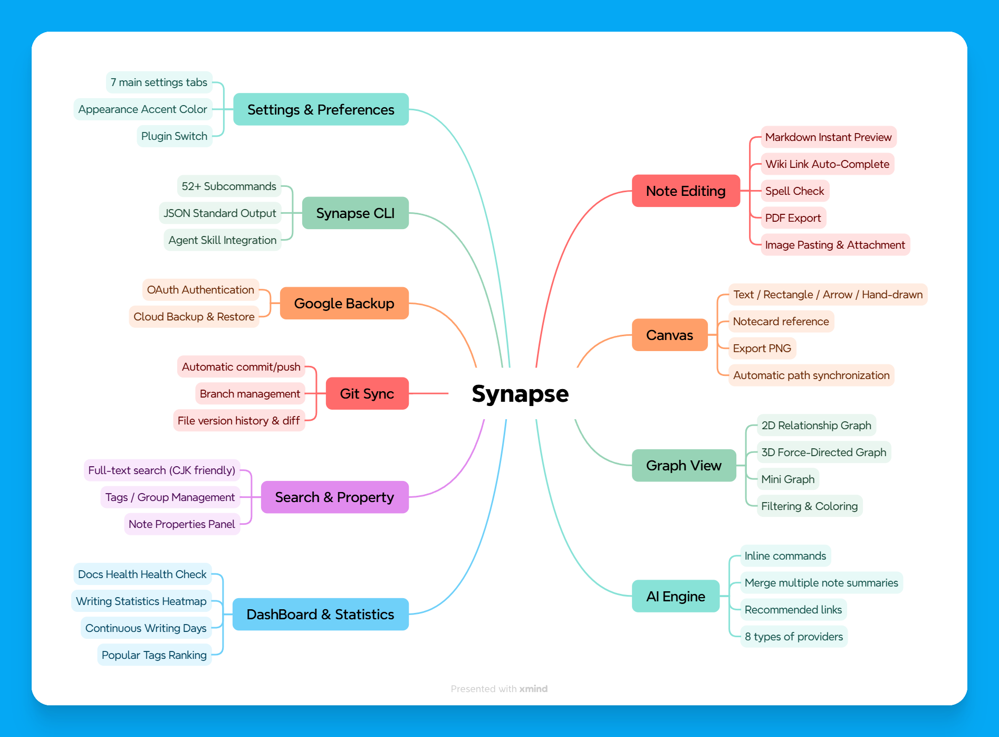

<table>
  <tr>
    <td width="30%" align="center">
      
    </td>
    <td width="70%" style="vertical-align: middle;">
      <h1>Synapse</h1>
      <h3>核心功能</h3>
      <ul>
        <li>支援 <b>Markdown</b> 筆記管理 + <b>Canvas</b> 視覺化白板</li>
        <li><b>2D / 3D</b> 關聯圖圖譜</li>
        <li><b>AI 引擎</b>（8 種 Provider）行內指令 / 摘要合併 / 連結推薦</li>
        <li><b>DashBoard</b>：Docs Health 健康檢查 + 統計 Heatmap</li>
        <li>提供 <b>CLI</b>（52+ 子命令）+ <b>Agent Skill</b> 整合</li>
        <li><b>Git 同步</b> / <b>Google Drive 雲端備份</b></li>
      </ul>
    </td>
  </tr>
</table>


<br>

# Synapse 使用者指南（User Guide）

> Synapse 是一個以 **Tauri v2 + Rust + React 19 + TypeScript** 打造的 AI 原生桌面筆記軟體，
> 核心理念是「以 Markdown 管理知識庫」，同時整合 AI、圖譜、Canvas 與筆記統計。

---

## 1. 功能組成概覽

下圖以 Synapse 為中心，向外展開所有主要功能模組與子功能：



<br>

### 功能模組速覽表

| 模組 | 說明 | 互動方式 |
|------|------|----------|
| **筆記編輯** | CodeMirror 6 編輯器，支援 Markdown 即時預覽、`[[Wiki Link]]`、`/tag`、`/group` 自動完成 | GUI 主畫面中央 |
| **Canvas 畫布** | 視覺化白板，支援文字、矩形、箭頭、手繪、筆記卡片引用，可匯出 PNG | GUI「Canvas」分頁 |
| **2D 圖譜** | d3-force 關聯圖，顯示所有筆記之間的連結，支援篩選 / 著色 / 時間軸 | GUI「Graph」分頁 |
| **3D 圖譜** | Three.js 力導向圖，Rust 端計算 3D 佈局，支援旋轉 / 縮放 / 聚類 | GUI「3D Graph」分頁 |
| **Mini Graph** | 以當前筆記為中心的局部 BFS 子圖，快速觀察鄰近關聯 | GUI 右側面板 |
| **AI 引擎** | 支援 8 種 Provider（OpenAI / Gemini / Claude / Groq / OpenRouter / Nvidia / Ollama / Custom） | 編輯器 `@ai` 指令 / AI 面板 |
| **儀表板** | Docs Health（孤立筆記 / 失效連結 / 過期筆記 / 無標籤）+ 寫作統計 Heatmap | GUI「Dashboard」分頁 |
| **搜尋** | 全文搜尋，字元級比對（CJK 友善），含摘要與路徑 | GUI 搜尋面板 / CLI |
| **Git 同步** | 自動 add → commit → push，分支切換，檔案版本歷史 diff | 設定啟用後自動 / CLI |
| **Google Drive** | OAuth 認證，一鍵備份 / 列出備份 / 還原 | 設定啟用後操作 |
| **CLI** | 52+ 子命令，涵蓋所有核心功能，JSON 輸出，可程式化整合 | 終端機 / 腳本 |

---

## 2. 功能詳細說明

### 2.1 筆記編輯

Synapse 的核心是 **Markdown 筆記**。每篇筆記以 `.md` 檔案儲存在 Repo 資料夾中。

**基本操作：**
- 新增 / 讀取 / 編輯 / 刪除筆記
- 重新命名、移動、複製檔案與資料夾
- 拖曳或貼上**圖片**（自動存入同層 `assets/` 資料夾）
- 附加任意檔案（存入 `attachment/` 資料夾）
- 匯出筆記為 **PDF**

**編輯器功能：**
- **Markdown 即時預覽**（標題、Callout、表格、Checkbox、程式碼區塊）
- **`[[Wiki Link]]` 自動完成**：輸入 `[[` 即可搜尋並連結其他筆記
- **`/tag` 與 `/group` 自動完成**：快速加入標籤與群組
- **拼字檢查**（en_US 英文字典，可在設定中開啟/關閉）
- 常見快捷鍵：`Ctrl+N` 新增、`Ctrl+S` 儲存、`Ctrl+F` 搜尋

### 2.2 Canvas 畫布

Canvas 是視覺化的白板工具，在筆記之外提供自由排版的空間。

**工具列（6 種工具）：**
| 工具 | 說明 |
|------|------|
| Select | 選取、移動、縮放節點 |
| Text | 新增文字節點 |
| Rect | 新增矩形節點 |
| Arrow | 繪製連接箭頭（支援 port 指定：上/下/左/右） |
| Note | 引用現有筆記卡片（自動顯示筆記標題） |
| Pen | 手繪線條 |

**特色功能：**
- 支援平移 / 縮放 / 多選
- 箭頭可加標籤
- 筆記卡片引用：**檔案重命名或移動時，Canvas 路徑自動同步更新**
- 可匯出整個畫布為 **PNG** 圖片
- Canvas 資料儲存於 `<repo>/.synapse/canvas/*.json`

### 2.3 圖譜視覺化

#### 2D 關聯圖

全域關聯圖顯示 Repo 中所有筆記的 `[[Wiki Link]]` 連結關係：
- 以 **d3-force** 力導向佈局排列
- 支援依 `folder` / `tag` / `group` **著色**
- 支援篩選：附件、Canvas、孤立筆記
- 可調整力場參數（排斥力、連結距離、中心力）
- 右鍵節點可直接開啟筆記

#### 3D 力導向圖

三維視角的關聯圖，適合大量筆記的全局觀察：
- 使用 **Three.js + OrbitControls** 實現 3D 旋轉 / 縮放
- Rust 端預先計算 3D 佈局位置，前端渲染
- 支援依 `folder` / `tag` / `group` 著色 + 聚類
- 可調整力場參數與搜尋高亮

#### Mini Graph（局部圖）

在右側面板中，以**當前筆記**為中心，顯示鄰近的 BFS 子圖：
- 可調整局部圖深度（`localGraphDepth`）
- 快速導航到相關筆記

### 2.4 AI 引擎

Synapse 內建 AI 功能，支援 **8 種 LLM Provider**：

| Provider | 預設模型 | 說明 |
|----------|---------|------|
| **OpenAI** | `gpt-4o-mini` | OpenAI API |
| **Google** | `gemini-2.0-flash` | Google Generative AI |
| **Claude** | `claude-sonnet-4-20250514` | Anthropic API |
| **Groq** | `llama-3.3-70b-versatile` | Groq 高速推理 |
| **OpenRouter** | `openai/gpt-4o-mini` | 多模型路由 |
| **Nvidia** | `meta/llama-3.1-8b-instruct` | Nvidia NIM |
| **Ollama** | `llama3.2` | 本地模型（無需 API Key） |
| **Custom** | 自訂 | 自訂 Base URL 與模型 |

**AI 功能：**

1. **`@ai` 行內指令**：在編輯器中輸入 `@ai <指令>`，AI 會根據選取文字或上下文回覆 Markdown 結果
2. **多筆記摘要合併**：選取多篇筆記（最多 20 篇），AI 自動生成摘要並加入 `[[wikilink]]` 回連
3. **連結推薦**：基於關鍵詞重疊度演算法，推薦可能相關的筆記

**設定方式：**
在「設定 → AI」中選擇 Provider、填入 API Key、選擇模型即可。

### 2.5 Dashboard & Writing Statistics

#### Docs Health（知識庫健康檢查）

儀表板顯示以下統計卡片與問題清單：

| 統計卡片 | 說明 |
|----------|------|
| 筆記總數 | Repo 中所有 .md 筆記數 |
| 連結總數 | 所有 `[[wikilink]]` 數 |
| 標籤總數 | 所有不重複標籤數 |
| 群組總數 | 所有不重複群組數 |

| 問題類型 | 說明 |
|----------|------|
| 孤立筆記 | 沒有任何筆記連結過來的筆記 |
| 失效連結 | 連結目標不存在的 `[[wikilink]]` |
| 過期筆記 | 超過 N 天未更新的筆記（天數可自訂） |
| 無標籤筆記 | 尚未加上任何標籤的筆記 |

每個問題區段可展開，**點擊即可直接開啟對應筆記**。

#### Writing Statistics

- **GitHub 風格 Heatmap 熱力圖**：按日顯示編輯次數，5 級色階
- **目前連續寫作天數**（Current Streak）
- **年度最長連續天數**（Longest Streak）
- **年度編輯筆記數**（Total Notes Modified）
- **平均每活躍日編輯數**
- **熱門標籤排行**
- 可點擊日期查看當天修改數

### 2.6 搜尋與屬性

**全文搜尋：**
- 支援中文、英文及混合搜尋（字元級比對，CJK 友善）
- 回傳匹配路徑、分數與摘要
- 可指定搜尋結果上限

**筆記屬性：**
- 每篇筆記可設定 `tags`（標籤）、`groups`（群組）
- 附件自動記錄（`attachments`）
- 自動時間戳：`created_at`、`modified_at`
- 左側面板支援切換 `files` / `tags` / `groups` / `outline` / `git-history` 視圖

### 2.7 Git 同步

啟用 Git 同步後，Synapse 可自動管理版本控制：

- **自動同步**：`add → commit → push`（帶時間戳訊息）
- **分支管理**：列出分支、切換分支
- **檔案版本歷史**：查看單一筆記的 Git commit 歷史
- **Diff 比對**：選擇任一歷史版本與目前內容對比
- 關閉視窗時可自動觸發 Git 同步

**啟用方式：**設定 → Plugins → 開啟 `gitSync`，填入 Remote URL

### 2.8 Google Drive 雲端備份

- 完整 **OAuth 認證**流程（瀏覽器授權）
- **一鍵備份**：將整個 Repo 打包上傳至 Google Drive
- **列出備份**：查看所有雲端備份紀錄
- **還原**：從 Google Drive 下載並還原備份
- 支援關閉視窗時自動備份

**啟用方式：**設定 → Plugins → 開啟 `googleDriveEnabled`

### 2.9 設定與外觀

設定頁面共有 **7 個分頁**：

| 分頁 | 說明 |
|------|------|
| General | 語言、資料庫路徑 |
| Editor | 編輯器偏好 |
| Appearance | 主題（亮/暗）、Accent Color 自訂主色調 |
| Plugins | Git Sync、Google Drive、Graph Enhancer 等開關 |
| AI | AI Provider 選擇、API Key、模型 |
| Syntax | Prism 程式碼語法高亮主題 |
| About | 版本資訊 |

---

## 3. 基本操作流程

### 3.1 首次使用

1. 啟動 Synapse，選擇或建立一個 **Database** 資料夾
2. 在 Database 內建立 **Repo**（可視為一個知識庫）
3. 在 Repo 內建立資料夾與筆記（`.md`）
4. 使用左側樹狀清單管理檔案，中央區域編輯筆記，右側查看關聯與屬性

### 3.2 主要資料儲存位置

| 位置 | 用途 |
|------|------|
| `<database>/.database/` | 全域設定（workspace、setting） |
| `<repo>/.synapse/` | Repo 內設定（workspace、graphview、attributes） |
| `<repo>/.synapse/canvas/` | Canvas 畫布資料 |
| `%APPDATA%/synapse/application.json` | App 使用者偏好（Windows） |

---

## 4. CLI（命令列工具）

Synapse 提供 `synapse_cli`，讓你不用開 GUI 也能操作所有核心功能。

### 4.1 適合使用 CLI 的情境

- 批次建立/修改筆記
- 自動化腳本（排程、備份、報表）
- 與其他工具整合（Python / Node / PowerShell）
- AI Agent 自動操作知識庫

### 4.2 建置 CLI

```bash
cd src-tauri
cargo build --release --bin synapse_cli
```

輸出位置：`src-tauri/target/release/synapse_cli.exe`（Windows）

### 4.3 指令格式

```bash
synapse_cli -d <database_path> [-r <repo_name>] <command> [args...]
```

| 旗標 | 說明 |
|------|------|
| `-d, --database` | Database 路徑（大多數命令必填） |
| `-r, --repo` | 目標 Repo（可省略，自動偵測） |

### 4.4 命令分類總覽

| 分類 | 命令 |
|------|------|
| **資料庫** | `init-database`, `list-repos`, `list-repo-summaries`, `create-repo`, `select-repo`, `delete-repo`, `get-active-repo-path` |
| **檔案樹** | `list-tree`, `create-folder`, `move-item`, `copy-item`, `rename-item`, `delete-item` |
| **筆記** | `list-notes`, `create-note`, `read-note`, `save-note`, `search` |
| **屬性** | `get-attrs`, `set-attrs`, `get-all-attrs`, `list-tags-groups` |
| **圖形與統計** | `scan-links`, `vault-health`, `writing-stats`, `git-file-history` |
| **狀態** | `get-workspace`, `set-workspace`, `get-graphview`, `set-graphview`, `get-setting`, `set-setting`, `get-prefs`, `set-prefs`, `get-prefs-path` |
| **Git** | `git-check-installed`, `git-get-config`, `git-set-config`, `git-check-repo`, `git-init`, `git-add-remote`, `git-get-remote`, `git-get-branch`, `git-init-commit-push`, `git-auto-sync`, `git-status-dirty`, `git-log`, `git-list-branches`, `git-checkout` |
| **AI** | `ai-suggest-links`, `get-ai-config`, `set-ai-config` |
| **Canvas** | `list-canvases`, `read-canvas`, `create-canvas`, `delete-canvas` |

### 4.5 常用範例

```bash
# 列出 repos
synapse_cli -d "D:/Notes" list-repos

# 列出某個 repo 的筆記
synapse_cli -d "D:/Notes" -r Work list-notes

# 讀取筆記
synapse_cli -d "D:/Notes" -r Work read-note "Project/Plan.md"

# 寫入筆記（支援 @file 語法讀取檔案）
synapse_cli -d "D:/Notes" -r Work save-note "Project/Plan.md" "# Plan\n\nUpdated"

# 全文搜尋
synapse_cli -d "D:/Notes" -r Work search "關鍵字" 20

# 知識庫健康檢查
synapse_cli -d "D:/Notes" -r Work vault-health 30

# 寫作統計
synapse_cli -d "D:/Notes" -r Work writing-stats 365

# AI 連結推薦
synapse_cli -d "D:/Notes" -r Work ai-suggest-links "Project/Plan.md"

# Canvas 操作
synapse_cli -d "D:/Notes" -r Work list-canvases
synapse_cli -d "D:/Notes" -r Work create-canvas "我的畫布"

# Git 檔案歷史
synapse_cli -d "D:/Notes" -r Work git-file-history "Project/Plan.md" 10

# Git 自動同步
synapse_cli -d "D:/Notes" git-auto-sync
```

### 4.6 輸出格式

- 成功：JSON 輸出到 stdout，exit code `0`
- 失敗：`{"error":"..."}` 輸出到 stderr，exit code `1`

建議所有外部程式都以「解析 JSON」方式處理 CLI 回傳。

### 4.7 完整命令文件

- [API.md](./API.md)（英文）
- [API.zh-TW.md](./API.zh-TW.md)（繁體中文）

---

## 5. Agent Skills

Synapse 專案附帶一個 Skill 定義檔：`Agent-Skill/SKILL.md`。

### 5.1 這是什麼？

`SKILL.md` 是給 AI Agent（例如 Codex / Claude 類工具）使用的「能力說明」。
Agent 可依此定義自動呼叫 Synapse CLI 完成各種操作。

### 5.2 Agent 能做什麼

啟用 `synapse-cli` Skill 後，Agent 可自動：
- 建立 / 讀取 / 更新 / 刪除筆記
- 管理 Repo、資料夾、檔案樹
- 設定 note attributes（tags / groups）
- 執行搜尋與圖譜掃描
- 操作 Canvas 畫布
- 查詢知識庫健康狀態與寫作統計
- 讀寫 workspace / settings / AI 設定
- 執行 Git 操作

### 5.3 使用方式（給 AI 的描述建議）

- 明確提供 Database 路徑
- 若可行，提供 Repo 名稱
- 指定你要的輸出格式（JSON、表格、摘要）

範例：
- 「請用 Synapse CLI 掃描 `D:/Notes` 的 `Work` repo，找出最近修改且含 AI 的筆記」
- 「請把 `Project/Plan.md` 加上 tag：`roadmap`、`priority`」
- 「幫我建立一個新的 Canvas，標題叫『專案架構圖』」
- 「顯示 Work repo 的 vault-health，過期天數設 30 天」

---

## 補充

- **手動寫作與知識整理** → 優先使用 GUI
- **自動化、整合外部工具、批次處理** → 優先使用 CLI
- **用自然語言驅動操作** → 搭配 Agent Skills 最有效率

---

文件版本：`2026-03-01`（依目前程式碼狀態整理）
